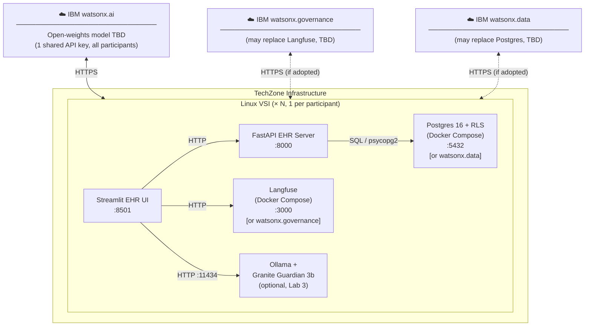

# Environment Topology

## High-level design

Each participant is provisioned a dedicated TechZone Linux VSI. All workshop
services run locally within that VSI — there is no shared application server
between participants. All participants share a single IBM watsonx.ai API key
(provisioned by the facilitator) to call the hosted LLM.

> **Model selection TBD.** The specific open-weights model hosted on watsonx.ai
> needs to be validated against the workshop tasks before the event. The primary
> requirement is reliable tool/function calling, which not all open-weights
> models support consistently. Candidates should be benchmarked against Labs 1
> and 3 (multi-step ReAct + critic) before committing to one.

> **IBM software substitutions under consideration.** The current stack uses
> open-source components for observability and data storage. Two substitutions
> are being evaluated:
>
> - **watsonx.governance** in place of Langfuse (Lab 2 observability/tracing)
> - **watsonx.data** in place of Postgres 16 + RLS (Lab 4 data access control)
>
> These are shown as dashed connections in the diagram above. The decision
> affects both the TechZone environment spec and the lab instructions; it should
> be made before environment provisioning is finalised.

---

## Communication map

| From | To | Protocol / port | Labs | Status |
|---|---|---|---|---|
| Agent code (Python) | IBM watsonx.ai | HTTPS · 443 | All | Confirmed |
| Streamlit UI | FastAPI EHR Server | HTTP · `:8000` | All | Confirmed |
| Agent / UI | Langfuse **or watsonx.governance** | HTTP · `:3000` / HTTPS · 443 | 2, 3, 4 | TBD |
| FastAPI EHR Server | Postgres 16 **or watsonx.data** | TCP · `:5432` / HTTPS · 443 | 4 | TBD |
| Agent code (Python) | Ollama | HTTP · `:11434` | 3 (optional) | Confirmed |

---

## Per-VSI stack

| Component | How provisioned | Required for | Status |
|---|---|---|---|
| Python 3.11 + uv | Pre-installed on VSI image | All labs | Confirmed |
| Workshop repo | `git clone` + `uv sync` | All labs | Confirmed |
| watsonx.ai API key | Shared key provided by facilitator, set in `.env` | All labs | Confirmed |
| Docker Engine + Compose | Pre-installed on VSI image | Labs 2–4 | Confirmed |
| Langfuse stack | `docker compose -f docker-compose.langfuse.yml up` | Lab 2+ | **May be replaced by watsonx.governance** |
| Postgres 16 stack | `docker compose up` | Lab 4 | **May be replaced by watsonx.data** |
| Ollama + Granite Guardian 3b | `ollama pull ibm/granite3.2-guardian:3b` | Lab 3 (optional) | Confirmed |
