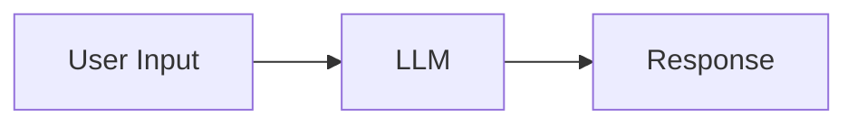
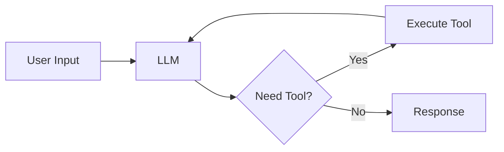
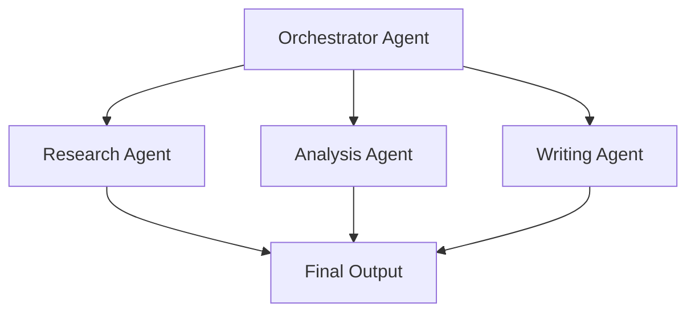

# Getting Started with AI Agents

Welcome to the AI Agents Workshop! This page introduces the core concepts you'll need to understand before building your first agent.

## What is an AI Agent?

An AI agent is an autonomous system that can perceive its environment, make decisions, and take actions to achieve specific goals. Unlike simple chatbots that only respond to queries, agents can:

- **Plan** multi-step solutions to complex problems
- **Use tools** to interact with external systems
- **Remember** context across interactions
- **Learn** from feedback and experience
- **Adapt** their behavior based on results

## Agent Components

### 1. The LLM Core

The language model serves as the "brain" of the agent, providing:

- Natural language understanding
- Reasoning and decision-making
- Response generation
- Tool selection and parameter filling

### 2. Memory Systems

Agents need memory to maintain context:

- **Short-term memory**: Current conversation and immediate context
- **Long-term memory**: Persistent knowledge and learned patterns
- **Working memory**: Intermediate results during task execution

### 3. Tools and Actions

Tools extend agent capabilities beyond text generation:

- API calls to external services
- Database queries
- File system operations
- Calculations and data processing
- Web searches and scraping

### 4. Planning and Reasoning

Agents use various strategies to solve problems:

- **ReAct**: Reason about what to do, then act
- **Chain-of-Thought**: Break down complex reasoning
- **Tree-of-Thoughts**: Explore multiple solution paths
- **Reflection**: Self-critique and improvement

## Agent Architectures

### Simple Agent



A basic agent that processes input and generates responses.

### Tool-Using Agent



An agent that can call external tools to gather information or perform actions.

### Multi-Agent System



Multiple specialized agents working together on complex tasks.

## Common Frameworks

Several frameworks make it easier to build AI agents:

### LangChain

- Comprehensive framework for LLM applications
- Rich ecosystem of tools and integrations
- Strong community support

### LlamaIndex

- Focused on data indexing and retrieval
- Excellent for RAG (Retrieval Augmented Generation)
- Optimized for document processing

### AutoGen

- Microsoft's multi-agent framework
- Supports complex agent conversations
- Built-in code execution capabilities

### CrewAI

- Role-based agent framework
- Simplified multi-agent orchestration
- Task delegation and collaboration

## Key Concepts

### Prompting Strategies

Effective agent behavior depends on good prompts:

```python
system_prompt = """
You are a helpful AI assistant with access to tools.
When solving problems:
1. Break down complex tasks into steps
2. Use tools when you need external information
3. Verify your results before responding
4. Ask for clarification if needed
"""
```

### Tool Definitions

Tools must be clearly defined for the agent:

```python
def search_web(query: str) -> str:
    """
    Search the web for information.
    
    Args:
        query: The search query string
        
    Returns:
        Search results as formatted text
    """
    # Implementation here
    pass
```

### Error Handling

Agents should gracefully handle failures:

- Retry with exponential backoff
- Fallback to alternative approaches
- Clear error messages to users
- Logging for debugging

## Best Practices

1. **Start Simple**: Begin with basic functionality, add complexity gradually
2. **Test Thoroughly**: Validate agent behavior with diverse inputs
3. **Monitor Performance**: Track success rates and failure modes
4. **Iterate Based on Feedback**: Continuously improve based on real usage
5. **Set Clear Boundaries**: Define what the agent can and cannot do

## Next Steps

Now that you understand the fundamentals, let's build your first agent!

Proceed to [Lab 1: Introduction to AI Agents](./lab-1.md) to start coding.

---

## Additional Reading

- [ReAct Paper](https://arxiv.org/abs/2210.03629) - Reasoning and Acting
- [Chain-of-Thought Prompting](https://arxiv.org/abs/2201.11903)
- [Tool Learning Survey](https://arxiv.org/abs/2304.08354)
- [LangChain Documentation](https://python.langchain.com/)