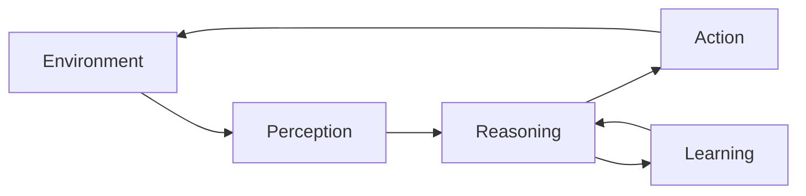

# AI Agents Workshop

???+ abstract "ODSC Workshop — 2 Hours"
    A hands-on introduction to building, observing, improving, and securing AI agents. We'll move from theory to working code across four progressive labs.

    **Format:**

    - **First 30 min** — Presentation: AI Development Lifecycle + Opportunities, Risks & Mitigation
    - **4 × 20 min labs** — Hands-on implementation, each building on the last

---

## Workshop Flow

1. [Prerequisites](./prerequisites.md) — Set up your environment before the session
2. [Getting Started](./getting-started.md) — What you need to know going in
3. [Slides](./slides.md) — Educational presentation (ADLC + Risks & Mitigation)
4. [Lab 1: Naive Agent Implementation](./lab-1.md) — Build the core agent loop
5. [Lab 2: Observability](./lab-2.md) — Instrument and trace your agent
6. [Lab 3: Improving Your Agent](./lab-3.md) — Fix failure modes, add guardrails
7. [Lab 4: Securing Data Used By The Agent](./lab-4.md) — Harden against injection and leakage

---

## What Are AI Agents?

AI agents are autonomous systems that can:

- **Perceive** their environment through sensors or data inputs
- **Reason** about goals and make decisions
- **Act** to achieve objectives using available tools
- **Learn** from experience to improve performance

---

## Prerequisites

Before the session, ensure you have:

- Python 3.11 or higher
- Basic Python programming familiarity
- Familiarity with APIs and REST concepts

See the [Prerequisites](./prerequisites.md) page for full setup instructions.

---

## Getting Help

If you run into issues:

1. Check the [Prerequisites](./prerequisites.md) page
2. Ask in the room — that's what we're here for
3. Open an issue on [GitHub](https://github.com/obuzek/ai-agents-workshop)
