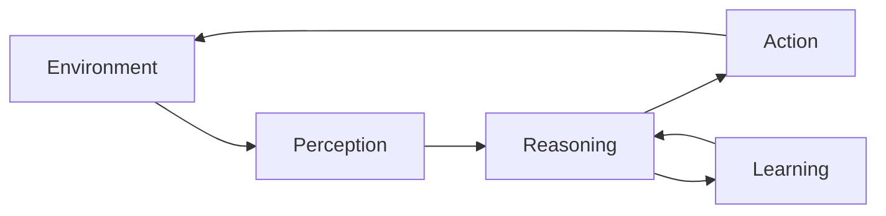

# AI Agents Workshop

???+ abstract "What You'll Learn"
    In this hands-on workshop, you'll learn how to build intelligent AI agents from the ground up. We'll cover the fundamentals of agent architecture, practical implementation patterns, and best practices for production deployment.

    **Workshop Highlights:**

    - **Foundations**: Understanding AI agents, their components, and architecture patterns
    - **Hands-On Building**: Create your first AI agent with practical examples
    - **Advanced Patterns**: Observability, reliability, and security for agents
    - **Production Ready**: Testing, monitoring, and deployment strategies
    - **Real-World Applications**: Use cases and implementation patterns

## Workshop Flow

1. [Prerequisites](./prerequisites.md) — Set up your development environment
2. [Getting Started](./getting-started.md) — Introduction to AI agents and core concepts
3. [Slides](./slides.md) — AI Development Lifecycle + Opportunities, Risks & Mitigation
4. [Lab 1: The Naive Agent](./lab-1.md) — Build a naive doctor inbox agent and see where it breaks
5. [Lab 2: Observability](./lab-2.md) — Instrument and trace your agent
6. [Lab 3: Improving Your Agent](./lab-3.md) — Fix failure modes, add guardrails
7. [Lab 4: Securing Data Used By The Agent](./lab-4.md) — Harden against injection and leakage

???+ tip "Time Estimate"
    The workshop runs for 2 hours: ~30 minutes of presentation followed by four ~20-minute labs.

---

## What Are AI Agents?

AI agents are autonomous systems that can:

- **Perceive** their environment through sensors or data inputs
- **Reason** about goals and make decisions
- **Act** to achieve objectives using available tools
- **Learn** from experience to improve performance

---

## Key Concepts

### Agent Architecture

Modern AI agents typically consist of:

- **LLM Core**: Language model for reasoning and decision-making
- **Memory**: Short-term and long-term information storage
- **Tools**: Functions the agent can call to interact with the world
- **Planning**: Strategy for breaking down complex tasks
- **Execution**: Runtime for carrying out actions

### Common Patterns

- **ReAct**: Reasoning and Acting in an interleaved manner
- **Chain-of-Thought**: Breaking down complex reasoning into steps
- **Tool Use**: Extending agent capabilities with external functions
- **Multi-Agent**: Coordinating multiple specialized agents

---

## Prerequisites

Before starting the workshop, ensure you have:

- Python 3.11 or higher
- Basic understanding of Python programming
- Familiarity with APIs and REST concepts
- (Optional) Experience with LLMs and prompt engineering

See the [Prerequisites](./prerequisites.md) page for detailed setup instructions.

---

## Workshop Structure

### Lab 1: The Naive Agent
Build a doctor inbox triage agent from scratch — no frameworks, no guardrails, no access controls. See why that's a problem.

### Lab 2: Observability
Instrument your agent with tracing and logging so you can see what it's doing.

### Lab 3: Improving Your Agent
Use observability data to fix failure modes and add guardrails.

### Lab 4: Securing Data Used By The Agent
Harden your agent against prompt injection and data leakage.

---

## Additional Resources

- [Additional Resources](./resources.md) — Links to papers, frameworks, and tools
- [Contributing](./contributing.md) — How to contribute to this workshop

---

## Getting Help

If you encounter issues during the workshop:

1. Check the [Prerequisites](./prerequisites.md) page for setup help
2. Review the lab instructions carefully
3. Ask questions in the workshop discussion forum
4. Open an issue on GitHub for bugs or improvements

Let's get started! Head to [Prerequisites](./prerequisites.md) to set up your environment.
