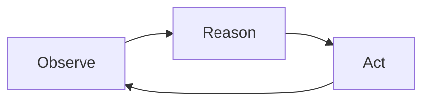

# Lab 1: The Naive Agent

**Duration:** ~20 minutes

???+ abstract "What You'll Build"
    In this lab you'll explore a naive AI agent that helps doctors manage their patient portal inbox. You'll learn the core agent loop, see how LangGraph and Structured Outputs work together, and run the agent against real (synthetic) patient data.

    By the end you'll have a working agent, a clear sense of what it does well, and a list of problems you'd want to fix before putting this anywhere near a real clinic.

---

## The Problem

Since the introduction of Electronic Health Record (EHR) portals, doctors are overwhelmed with messages from their patients. A single message might contain several unrelated questions. Some are urgent; most are routine. Responding to all of them comes on top of a full patient load — and that means keeping up is exhausting.

When patients don't get responses, important medical needs can go unaddressed.

???+ example "A real inbox backlog"
    Dr. Sarah Kim at **Lakeview Family Medicine** has 12 patients in the workshop dataset. Among them there are **10 unresolved portal messages** — including an urgent message from a patient whose pharmacy is refusing to fill their warfarin prescription, and a follow-up complaint that nobody has responded.

    How should Dr. Kim prioritize? Which messages need attention today, and which can wait? What patient history is relevant to each message?

### The Question

Can we use an AI agent to support doctor-patient communication outside of appointments in a way that:

- **Preserves the doctor-patient relationship** — the doctor stays in the loop
- **Keeps the doctor as the expert** — the agent surfaces information, it doesn't make medical decisions
- **Reduces cognitive load** — the agent organizes and prioritizes, so the doctor can focus on the medicine

???+ warning "What we are NOT building"
    We are *not* building an agent that drafts responses for the doctor, makes diagnoses, or acts autonomously on patient care. That would be the Gmail "draft it for you" anti-pattern — tempting, but dangerous in a domain where the human must remain the expert.

    Instead, we want the agent to **surface and organize** information so the doctor can act on it efficiently. Think "intelligent inbox triage," not "AI doctor."

---

## The Agent Loop: Observe, Reason, Act

Before we build anything, let's understand the core pattern behind every AI agent.

The community has converged on **ReAct** (Yao et al., 2023) as the standard agent architecture. It's a loop with three steps:



| Step | What happens | In our case |
|---|---|---|
| **Observe** | The agent takes in new information — a query, updated data, tool results | A new patient message arrives, or the agent reads a patient record |
| **Reason** | The LLM decides what to do next — call a tool, ask for more info, or respond | "This message mentions warfarin — I should look up the patient's medication list and recent labs" |
| **Act** | The agent executes — calls a tool, writes to memory, or produces output | Calls `get_patient_record()`, reads the result, then summarizes findings |

The loop repeats until the agent decides it has enough information to produce a final response.

### Chat agents vs. background agents

Most people encounter agents as **chat agents** — you type a message, the agent reasons and responds, you type another message. The user drives each turn.

But there's another pattern that's often a better fit for real systems: the **background agent**.

| | Chat agent | Background agent |
|---|---|---|
| **Trigger** | User sends a message | New data arrives (a patient message, a database update) |
| **Session** | User-driven, multi-turn | Data-driven, often single-turn |
| **Ending** | User stops chatting | Agent decides it's done |
| **UI** | Chat window | Dashboard, inbox, notifications |

For our doctor inbox problem, a background agent is the better design: incoming patient messages trigger the agent, it processes them and updates a structured inbox, and the doctor interacts with the *inbox UI* — not with a chat window.

???+ tip "Why not chat?"
    A chat interface is risky here because you can't stop doctors from asking the agent to draft responses, make diagnoses, or confirm medical correctness. An inbox UI keeps the agent's role constrained to organizing information, preserving the doctor's role as the expert.

---

## The Data

The workshop includes a set of synthetic EHR patient records in the `data/` directory. These simulate **Lakeview Family Medicine**, a small GP practice with three providers and 12 patients.

Each patient file (`data/patients/patient_001.json` through `patient_012.json`) contains:

| Section | Contents |
|---|---|
| `demographics` | Name, DOB, contact info, insurance, preferred language |
| `socialHistory` | Smoking, alcohol, exercise, lifestyle notes |
| `familyHistory` | Family medical conditions |
| `allergies` | Known allergies with reactions and criticality |
| `conditions` | Active/resolved conditions with ICD-10 codes |
| `medications` | Current medications with RxNorm codes, dosages, prescribers |
| `immunizations` | Vaccination records with CVX codes |
| `encounters` | Office visit notes in SOAP format |
| `labs` | Lab results with LOINC codes, values, reference ranges |
| `messages` | Patient portal messages with threading and priority |

???+ info "How this data was generated"
    The synthetic data was generated using a structured pipeline designed to avoid common LLM pitfalls — see `data/README.md` for the full methodology. Key points:

    - A **diversity matrix** (`data/patient_specs.json`) was defined *before* generation to ensure varied demographics, conditions, communication styles, and clinical archetypes
    - Demographics were deliberately **decoupled from clinical attributes** — names and implied ethnicity do not predict occupation, condition, or communication style
    - Each patient was generated by an **isolated subagent** to prevent cross-patient pattern reuse
    - All medical codes (ICD-10, LOINC, RxNorm, CVX) are real

---

## Learning Objectives

By the end of this lab, you will:

- [x] Understand the ReAct loop (Observe → Reason → Act) and how it maps to LangGraph's `create_react_agent`
- [x] Know the difference between an agent that *surfaces information* and one that *generates content* — and why it matters in healthcare
- [x] Understand how Structured Outputs and constrained decoding eliminate JSON parsing headaches
- [ ] Run the agent against synthetic patient data and examine its output
- [ ] Identify the limitations of a naive implementation

---

## Step 1: Explore the EHR Viewer

Before we look at any agent code, let's get oriented with the application.

Start the EHR data viewer (you don't need an API key for this part):

```bash
# Terminal 1: Start the backend API
uv run uvicorn app.api:app --port 8000

# Terminal 2: Start the Streamlit UI
uv run streamlit run app/ui.py --server.port 8501
```

Open [http://localhost:8501](http://localhost:8501) in your browser.

This is Dr. Kim's inbox dashboard. Take a minute to explore:

- **Patient selector** (top) — switch between patients. The emoji shows inbox status.
- **Medical record** (left) — conditions, medications, labs, encounter history. Click the tabs.
- **Concerns panel** (right) — empty for now. This is where the agent's output will appear.
- **Inbox** (bottom left) — patient portal messages, newest first. Click one to see the full conversation.

???+ question "Look at the inbox"
    Browse a few patients and their messages. Notice how some messages touch on multiple topics — a patient might ask about a medication refill *and* report a new symptom in the same message.

    Now imagine you're Dr. Kim with a full day of appointments. How would you decide which messages need attention first?

---

## Step 2: Understand the Agent Code

Now let's look at how the agent works. The code lives in `lab1/agent/`.

### Tools: how the agent reads patient data

Open `lab1/agent/tools.py`. Each function decorated with `@tool` becomes something the LLM can call:

```python
@tool
def get_patient_record(patient_id: str) -> dict:
    """Get a patient's full record: demographics, conditions, allergies,
    medications, lab results, encounter history, messages, and social history."""
    resp = requests.get(f"{API_URL}/patients/{patient_id}")
    resp.raise_for_status()
    return resp.json()
```

The `@tool` decorator does three things automatically:

1. Registers the function as a callable tool
2. Generates a JSON schema from the type hints and docstring
3. Makes it available to the LLM during the ReAct loop

The agent has five tools: `list_patients`, `get_patient_record`, `get_messages`, `search_labs`, and `get_inbox`.

???+ question "Think about this"
    Notice that the agent can call `list_patients()` or `get_patient_record()` for *any* patient — not just the one it was asked to review. What could go wrong?

### The agent: LangGraph's ReAct loop

Open `lab1/agent/agent.py`. The core is surprisingly short:

```python
def _build_agent():
    llm = ChatOpenAI(model=MODEL)
    return create_react_agent(
        model=llm,
        tools=ALL_TOOLS,
        prompt=SYSTEM_PROMPT,
        response_format=PatientConcerns,
    )
```

`create_react_agent` builds the full ReAct loop for us:

1. Send the system prompt + user message to the LLM
2. If the LLM returns tool calls → execute them, feed results back, go to 1
3. If the LLM is done → make one final call with **Structured Outputs** to produce a `PatientConcerns` object

That last point is key: `response_format=PatientConcerns` tells the API to use **Structured Outputs**. Let's unpack what that means.

### Structured Outputs and constrained decoding

LLMs generate text one token at a time. Normally, every token in the vocabulary is a candidate at each step. **Constrained decoding** changes this: before each token is sampled, the API masks out every token that would make the output invalid according to your schema. The model literally cannot produce malformed JSON — it's not a "try and retry" approach, it's a hard constraint on generation.

When you pass `response_format=PatientConcerns` (a Pydantic model), the API converts it to a JSON schema and enforces it during generation. This gives you:

**Correctness for free.** Every field will be present, every enum value will be valid, every list will be a list. No parsing code, no fallback logic, no stripping markdown code fences from LLM output that decided to be "helpful."

**Fewer tokens, lower cost.** Without structured outputs, you'd need to describe the exact JSON format you want *in the prompt* — field names, types, enum values, examples. That's easily 200-400 extra tokens of instructions on every call, and the model might still get it wrong, requiring a retry (which doubles your cost). Constrained decoding moves all of that into the schema, so you don't pay for it in prompt tokens *or* retry tokens.

**Background agents need this.** In a chat interface, a human can look at malformed output and ask "try again." A background agent has no human in the loop — if the output doesn't parse, the pipeline fails silently or crashes. Structured Outputs guarantee that every agent run produces a valid `PatientConcerns` object, even at 3 AM with no one watching.

???+ info "How is this different from asking nicely?"
    You might have seen prompts that say "respond in JSON with these fields..." — that's **prompting for structure**. It works most of the time, but the model can always surprise you with a markdown wrapper, a missing field, or a creative reinterpretation of your enum values.

    Structured Outputs are fundamentally different: the constraint is enforced at the token level during generation. It's the difference between asking someone to drive the speed limit and installing a speed governor on the engine.

### The output contract

Open `lab1/agent/models.py`. The `Concern` model defines what the agent produces:

```python
class Concern(BaseModel):
    id: str
    patient_id: str
    title: str
    summary: str            # one sentence
    action: str             # what the doctor should do
    concern_type: ConcernType  # medication, lab_result, symptom, follow_up, administrative
    urgency: Urgency        # routine, soon, urgent
    status: ConcernStatus   # unresolved, monitoring, resolved
    evidence: list[str]     # specific values and dates
    related: RelatedData    # links back to messages, labs, conditions, encounters
```

This is the **contract** between the agent and the UI. The agent fills it in; the UI renders it. The doctor never sees raw LLM output.

---

## Step 3: Run the Agent

Make sure you have an OpenAI API key set:

```bash
export OPENAI_API_KEY=your-api-key-here
```

Start the agent API (in addition to the two terminals from Step 1):

```bash
# Terminal 3: Start the agent API
uv run uvicorn lab1.agent.api:app --port 8001
```

Now go back to the UI at [http://localhost:8501](http://localhost:8501):

1. Select a patient from the dropdown
2. Click **Run Agent** in the Concerns panel
3. Wait for the agent to finish (the button will show "Agent Running...")
4. Examine the concerns that appear

The agent will call tools to explore the patient's record, then produce structured concerns with urgency levels, evidence, and recommended actions.

???+ tip "Try several patients"
    Run the agent on 2-3 different patients. Notice how:

    - Concerns are sorted by urgency (🔴 urgent → 🟡 soon → 🔵 routine)
    - Each concern has a specific **action** for the doctor
    - The **Related** links let you jump to the relevant message, lab, or encounter
    - The patient dropdown updates with urgency indicators

---

## Step 4: Evaluate the Output

Now the important part. Run the agent on a few patients and critically evaluate what it produces.

???+ question "Write down 2-3 things"
    For each patient you review, write down:

    1. **Something the agent got right** — a concern that's genuinely useful, well-evidenced, and actionable
    2. **Something the agent got wrong** — a concern that's misleading, vague, or incorrect
    3. **Something that's missing** — a real issue in the patient's record that the agent didn't surface

    Keep these notes. We'll use them throughout the remaining labs.

---

## What's Working

Let's acknowledge what this naive agent already does well:

**The ReAct loop works.** The agent autonomously decides which tools to call and in what order. It doesn't follow a hardcoded pipeline — it investigates based on what it finds. LangGraph handles the loop mechanics so we can focus on the prompt and tools.

**Structured Outputs eliminate parsing problems.** Constrained decoding guarantees valid JSON matching our Pydantic schema. No retries on malformed output, no code-fence stripping, no manual field mapping. This reduces both latency and cost.

**The UI keeps the doctor in control.** The doctor clicks a button, reviews structured output, and acts on it. There's no chat box where they might ask the agent to draft a reply or confirm a diagnosis. The agent's role is constrained by the interface itself.

**Background processing is the right pattern.** The agent runs in the background and writes to a store. The doctor sees results when they're ready — they don't have to sit in a conversation and wait for each response.

---

## What's Broken

But this agent has serious problems. Some you probably noticed in your evaluation:

### 🔓 No access controls

The agent can access any patient's data at any time. When you ask it to review `patient-001`, nothing stops it from calling `get_patient_record("patient-007")`. In a real system, this would violate HIPAA's minimum necessary standard — the agent should only see data relevant to its current task.

### 🎲 Concerns aren't stable

Run the agent twice on the same patient. You'll likely get different concerns — different titles, different urgency levels, maybe different issues entirely. The agent overwrites its previous output on every run. There's no persistence, no diffing, no way to track how concerns change over time.

### 🤥 No hallucination checks

The agent might report a lab value that doesn't exist, misattribute a symptom, or fabricate evidence. There's nothing in place to verify that the agent's output actually matches the patient record. We're trusting the LLM to be accurate — and it won't always be.

### 👨‍⚕️ The agent oversteps

Read the system prompt carefully. Despite explicit instructions to "not make clinical recommendations," the agent tends to:

- Suggest diagnoses ("possible hypothyroidism")
- Recommend treatments ("consider starting levothyroxine")
- Editorialize on urgency in ways that could bias the doctor

The LLM wants to be helpful. In healthcare, "helpful" can be dangerous.

### 📋 No completeness checks

How do you know the agent found *all* the concerns? It might surface 3 out of 5 real issues and you'd never know. There's no mechanism to verify coverage — no comparison against the actual record, no checklist, no second opinion.

---

## Up Next

These problems aren't just academic — they're the kind of issues that would stop a real healthcare system from deploying this agent.

In the remaining labs, we'll fix them:

| Lab | Problem | Solution |
|---|---|---|
| **Lab 2** | No visibility into what the agent is doing | Observability: tracing, logging, cost tracking |
| **Lab 3** | Unstable output, hallucinations, overstepping | Evaluation: output validation, grounding checks, guardrails |
| **Lab 4** | Unrestricted data access | Security: scoped tools, access controls, audit trails |

???+ tip "Keep your notes"
    The issues you wrote down in Step 4 are your personal roadmap for the next three labs. As we add observability, evaluation, and security, check whether each improvement addresses something you noticed.
