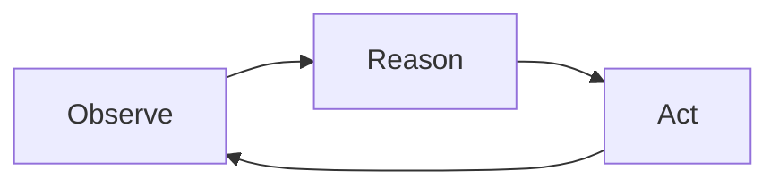

# Lab 1: The Naive Agent

**Duration:** ~20 minutes

???+ abstract "What You'll Build"
    In this lab you'll build a naive AI agent that helps doctors manage their patient portal inbox. You'll learn the core agent loop, connect it to real (synthetic) patient data, and see firsthand why a naive implementation — one with no guardrails, no access controls, and no observability — creates serious problems in a healthcare setting.

    By the end you'll have a working agent and a clear sense of where the rough edges are.

---

## The Problem

Since the introduction of Electronic Health Record (EHR) portals, doctors are overwhelmed with messages from their patients. A single message might contain several unrelated questions. Some are urgent; most are routine. Responding to all of them comes on top of a full patient load — and that means keeping up is exhausting.

When patients don't get responses, important medical needs can go unaddressed.

???+ example "A real inbox backlog"
    Dr. Sarah Kim at **Lakeview Family Medicine** has 12 patients in the workshop dataset. Among them there are **10 unresolved portal messages** — including an urgent message from a patient whose pharmacy is refusing to fill their warfarin prescription, and a follow-up complaint that nobody has responded.

    How should Dr. Kim prioritize? Which messages need attention today, and which can wait? What patient history is relevant to each message?

### The Question

Can we use an AI agent to support doctor-patient communication outside of appointments in a way that:

- **Preserves the doctor-patient relationship** — the doctor stays in the loop
- **Keeps the doctor as the expert** — the agent surfaces information, it doesn't make medical decisions
- **Reduces cognitive load** — the agent organizes and prioritizes, so the doctor can focus on the medicine

???+ warning "What we are NOT building"
    We are *not* building an agent that drafts responses for the doctor, makes diagnoses, or acts autonomously on patient care. That would be the Gmail "draft it for you" anti-pattern — tempting, but dangerous in a domain where the human must remain the expert.

    Instead, we want the agent to **surface and organize** information so the doctor can act on it efficiently. Think "intelligent inbox triage," not "AI doctor."

---

## The Agent Loop: Observe, Reason, Act

Before we build anything, let's understand the core pattern behind every AI agent.

The community has converged on **ReAct** (Yao et al., 2023) as the standard agent architecture. It's a loop with three steps:



| Step | What happens | In our case |
|---|---|---|
| **Observe** | The agent takes in new information — a query, updated data, tool results | A new patient message arrives, or the agent reads a patient record |
| **Reason** | The LLM decides what to do next — call a tool, ask for more info, or respond | "This message mentions warfarin — I should look up the patient's medication list and recent labs" |
| **Act** | The agent executes — calls a tool, writes to memory, or produces output | Calls `get_patient_record()`, reads the result, then summarizes findings |

The loop repeats until the agent decides it has enough information to produce a final response.

### Chat agents vs. background agents

Most people encounter agents as **chat agents** — you type a message, the agent reasons and responds, you type another message. The user drives each turn.

But there's another pattern that's often a better fit for real systems: the **background agent**.

| | Chat agent | Background agent |
|---|---|---|
| **Trigger** | User sends a message | New data arrives (a patient message, a database update) |
| **Session** | User-driven, multi-turn | Data-driven, often single-turn |
| **Ending** | User stops chatting | Agent decides it's done |
| **UI** | Chat window | Dashboard, inbox, notifications |

For our doctor inbox problem, a background agent is the better design: incoming patient messages trigger the agent, it processes them and updates a structured inbox, and the doctor interacts with the *inbox UI* — not with a chat window.

???+ tip "Why not chat?"
    A chat interface is risky here because you can't stop doctors from asking the agent to draft responses, make diagnoses, or confirm medical correctness. An inbox UI keeps the agent's role constrained to organizing information, preserving the doctor's role as the expert.

In this lab, we'll start by building the agent loop itself. The background-agent pattern and inbox UI will emerge as we progress through the labs.

---

## The Data

The workshop includes a set of synthetic EHR patient records in the `data/` directory. These simulate **Lakeview Family Medicine**, a small GP practice with three providers and 12 patients.

Each patient file (`data/patients/patient_001.json` through `patient_012.json`) contains:

| Section | Contents |
|---|---|
| `demographics` | Name, DOB, contact info, insurance, preferred language |
| `socialHistory` | Smoking, alcohol, exercise, lifestyle notes |
| `familyHistory` | Family medical conditions |
| `allergies` | Known allergies with reactions and criticality |
| `conditions` | Active/resolved conditions with ICD-10 codes |
| `medications` | Current medications with RxNorm codes, dosages, prescribers |
| `immunizations` | Vaccination records with CVX codes |
| `encounters` | Office visit notes in SOAP format |
| `labs` | Lab results with LOINC codes, values, reference ranges |
| `messages` | Patient portal messages with threading and priority |

???+ info "How this data was generated"
    The synthetic data was generated using a structured pipeline designed to avoid common LLM pitfalls — see `data/README.md` for the full methodology. Key points:

    - A **diversity matrix** (`data/patient_specs.json`) was defined *before* generation to ensure varied demographics, conditions, communication styles, and clinical archetypes
    - Demographics were deliberately **decoupled from clinical attributes** — names and implied ethnicity do not predict occupation, condition, or communication style
    - Each patient was generated by an **isolated subagent** to prevent cross-patient pattern reuse
    - All medical codes (ICD-10, LOINC, RxNorm, CVX) are real

### The inbox backlog

Several patients have **unresolved messages** — messages with no provider reply. These form the inbox backlog that our agent will help Dr. Kim triage:

```python
import json
import glob

# Load all patient records
patients = {}
for filepath in sorted(glob.glob("data/patients/*.json")):
    with open(filepath) as f:
        patient = json.load(f)
        patients[patient["id"]] = patient

# Find unresolved messages (no thread/reply)
backlog = []
for patient in patients.values():
    name = f"{patient['demographics']['name']['given']} {patient['demographics']['name']['family']}"
    for msg in patient.get("messages", []):
        if not msg.get("thread"):
            backlog.append({
                "patient": name,
                "patient_id": patient["id"],
                "message_id": msg["id"],
                "priority": msg["priority"],
                "category": msg["category"],
                "subject": msg["subject"],
                "date": msg["date"],
            })

print(f"Unresolved messages: {len(backlog)}\n")
for item in sorted(backlog, key=lambda x: (x["priority"] != "urgent", x["date"])):
    flag = "🔴" if item["priority"] == "urgent" else "⚪"
    print(f"  {flag} [{item['category']}] {item['patient']}: {item['subject']}")
```

Running this against the workshop data, you'll see the backlog includes urgent medication concerns alongside routine follow-ups — exactly the kind of prioritization problem that overwhelms a busy doctor.

---

## Learning Objectives

By the end of this lab, you will:

- [x] Understand the ReAct loop (Observe → Reason → Act) and how it applies to both chat and background agents
- [x] Know the difference between an agent that *surfaces information* and one that *generates content* — and why it matters in healthcare
- [ ] Implement tool calling manually against an LLM API
- [ ] Run your agent against the synthetic patient data end-to-end
- [ ] Identify the limitations of a naive implementation

---

## Step 1: Set Up Your Environment

```bash
# From the repository root
cd ai-agents-workshop

# Create and activate a virtual environment
uv venv
source .venv/bin/activate  # On Windows: .venv\Scripts\activate

# Install dependencies
uv pip install openai python-dotenv
```

Create a `.env` file with your API key:

```bash
# .env
OPENAI_API_KEY=your-api-key-here
```

Verify the data is accessible:

```bash
python -c "import json, glob; print(f'{len(glob.glob(\"data/patients/*.json\"))} patient files found')"
# Expected output: 12 patient files found
```

---

## Step 2: Define Your Tools

<!-- TODO: tool definitions for patient data access — get_patient_record, list_patients, get_unresolved_messages, etc. -->

```python
# TODO: add tool definitions
```

---

## Step 3: Implement the Agent Loop

<!-- TODO: naive ReAct loop implementation with full data access (intentionally no access controls) -->

```python
# TODO: add agent loop implementation
```

---

## Step 4: Run Your Agent

<!-- TODO: run instructions, example interactions, expected output -->

```bash
# TODO: add run instructions and expected output
```

---

## What Did We Learn?

By running this naive implementation you should have noticed:

- The agent can loop indefinitely without a stopping condition
- There's no visibility into what the agent is "thinking"
- Errors from tools aren't handled gracefully
- Nothing prevents the agent from accessing any patient's data, regardless of context
- The agent may go off-task — drafting responses instead of organizing, or making clinical inferences it shouldn't

These are the problems we'll address in the next three labs.

---

???+ tip "Up Next"
    Head to [Lab 2: Observability](./lab-2.md) to add tracing and logging so you can actually see what your agent is doing.
