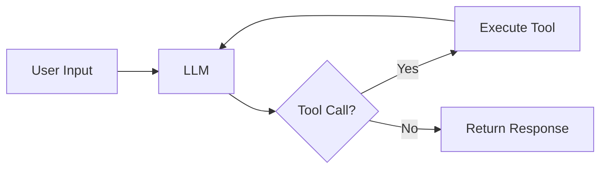

# Lab 1: Naive Agent Implementation

**Duration:** ~20 minutes

???+ abstract "What You'll Build"
    In this lab you'll implement a basic AI agent from scratch — no frameworks, no guardrails. The goal is to understand the core loop: receive input, reason with an LLM, call a tool, observe the result, repeat.

    By the end you'll have a working (if naive) agent and a clear sense of where the rough edges are.

---

## Learning Objectives

- Understand the agent reasoning loop (perceive → reason → act → observe)
- Implement tool calling manually against an LLM API
- Run your agent against a simple task end-to-end
- Identify the limitations of a naive implementation

---

## Overview

A minimal agent needs three things:

1. **A model** — to reason and decide what to do
2. **Tools** — functions the model can call
3. **A loop** — to keep running until the task is done

We'll build each piece in order.



---

## Step 1: Set Up Your Environment

```bash
# TODO: add setup instructions
```

---

## Step 2: Define Your Tools

```python
# TODO: add tool definitions
```

---

## Step 3: Implement the Agent Loop

```python
# TODO: add agent loop implementation
```

---

## Step 4: Run Your Agent

```bash
# TODO: add run instructions and expected output
```

---

## What Did We Learn?

By running this naive implementation you should have noticed:

- The agent can loop indefinitely without a stopping condition
- There's no visibility into what the agent is "thinking"
- Errors from tools aren't handled gracefully
- Nothing prevents the agent from taking unintended actions

These are the problems we'll address in the next three labs.

---

???+ tip "Up Next"
    Head to [Lab 2: Observability](./lab-2.md) to add tracing and logging so you can actually see what your agent is doing.
