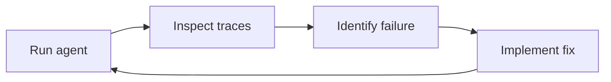
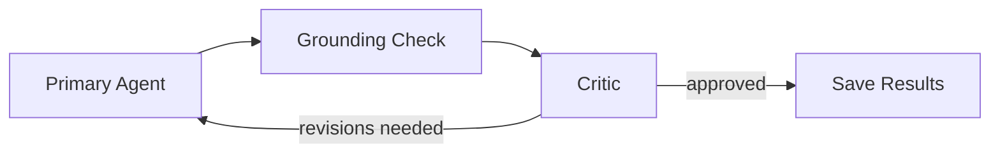

# Lab 3: Improving Your Agent

**Duration:** ~25 minutes

???+ abstract "What You'll Improve"
    The observable agent from Lab 2 has problems you can now see in the traces: it hallucinates evidence, goes off-task, and dumps the entire patient record into every run. In this lab you'll apply the improvement cycle — **identify** failure modes in traces, **reproduce** them, and **fix** them with targeted changes.

---

## The Improvement Cycle

Agent development is iterative. The cycle looks like this:



Lab 2 gave you the **inspect** step. Lab 3 gives you the **fix** step.

---

## Learning Objectives

By the end of this lab, you will:

- [x] Know how to use Langfuse traces to identify concrete agent failures
- [ ] Replace dump-everything tools with keyword-based search tools
- [ ] Add a critic agent that evaluates the primary agent's output in a loop
- [ ] Implement hallucination detection using Granite Guardian
- [ ] Compare LLM-as-judge vs. purpose-built grounding models

---

## Prerequisites (optional)

Granite Guardian grounding is **optional** — the lab works out of the box with LLM-as-judge grounding. If you want to compare both approaches, install Ollama:

1. Install [Ollama](https://ollama.com/)
2. Pull the Granite Guardian model:

```bash
ollama pull ibm/granite3.2-guardian
```

???+ tip "Why Ollama?"
    Granite Guardian runs locally — no API keys, no cloud dependency. Your patient data never leaves your machine, which matters when you're building hallucination detection for healthcare data.

---

## What Lab 2 Revealed

If you haven't already, run the Lab 2 agent and look at the traces in Langfuse. You'll find three problems:

### Problem 1: The agent hallucinates evidence

Compare the tool call outputs (what the data says) with the agent's concerns (what it claims). You'll find evidence strings that cite lab values, dates, or medication names that don't match what the tools returned. The agent is confidently stating facts that aren't in the record.

### Problem 2: The agent goes off-task

Despite the system prompt saying "do not make clinical recommendations," the agent suggests diagnoses, proposes treatments, or drafts replies to patient messages. It's doing the doctor's job instead of organizing what the doctor needs to see.

### Problem 3: Too much data, not enough focus

The `get_patient_record` tool dumps the **entire** patient record on every call — demographics, all conditions, all medications, all labs, all encounters, all messages. This wastes tokens, increases cost, and gives the agent more opportunities to hallucinate from irrelevant data.

???+ note "What about prompt injection?"
    You might wonder whether a patient could craft a portal message that hijacks the agent. In this system, that risk is **ameliorated by design**: the agent runs in the background, and its output goes to the **doctor** — not back to the patient. The patient never sees agent output, so there's no feedback loop to exploit. This is a deliberate architectural defense, not an accident. Security is about threat models, not checklists.

---

## Step 1: Focused Search Tools

Open `lab2/agent/tools.py` and look at `get_patient_record`:

```python
@tool
def get_patient_record(patient_id: str) -> dict:
    """Get a patient's full record: demographics, conditions, allergies,
    medications, lab results, encounter history, messages, and social history."""
    resp = requests.get(f"{API_URL}/patients/{patient_id}")
    resp.raise_for_status()
    return resp.json()
```

This returns *everything*. The agent has no reason to think about what's relevant — it gets it all for free.

Now open `lab3/agent/tools.py`. The dump-everything tool is gone, replaced by keyword-based search tools:

```python
@tool
def search_conditions(patient_id: str, keyword: str) -> list[dict]:
    """Search a patient's conditions by keyword (e.g., 'diabetes', 'hypertension')."""
    resp = requests.get(f"{API_URL}/patients/{patient_id}/conditions",
                        params={"q": keyword})
    resp.raise_for_status()
    return resp.json()
```

The agent must now specify *what* it's looking for. This forces it to reason about relevance: "The patient mentioned fatigue — let me search for thyroid conditions and check TSH labs." Instead of drowning in data, the agent investigates.

???+ question "Think about this"
    If we'd replaced `get_patient_record` with `get_conditions`, `get_medications`, `get_labs` (no keywords), what would the agent do? It would call all of them and reconstruct the full record. Keywords force intentional investigation.

The search endpoints use a recursive keyword matcher — a keyword like "diabetes" finds matches in nested fields like `code.display`, `notes`, or `assessment`:

```python
def _contains(obj, keyword: str) -> bool:
    """Recursively check if keyword appears in any string value."""
    if isinstance(obj, str):
        return keyword in obj.lower()
    if isinstance(obj, BaseModel):
        return any(_contains(getattr(obj, f), keyword) for f in obj.model_fields)
    if isinstance(obj, dict):
        return any(_contains(v, keyword) for v in obj.values())
    if isinstance(obj, (list, tuple)):
        return any(_contains(item, keyword) for item in obj)
    return False
```

Small functions, clear responsibilities. The search helper doesn't know about patients or tools — it just knows how to walk a data structure.

---

## Step 2: The Critic Loop

Focused tools reduce noise, but the agent can still hallucinate and go off-task. We need something to **check its work**.

The naive approach is to use the same LLM to evaluate its own output (LLM-as-judge). The problem: the LLM has the same biases and failure modes when judging as when generating. It's checking its own homework.

Lab 3 addresses this with a **two-part evaluation loop**:

1. **Grounding check** — verifies that evidence strings are supported by tool output data
2. **Critic** — evaluates whether the agent stayed on task

Both run inside a loop with the primary agent:



### The grounding module

Open `lab3/agent/grounding.py`. It has one job: given evidence claims and source data, determine which claims are supported.

Two implementations behind a toggle:

```python
# "llm" = LLM-as-judge (default), "guardian" = Granite Guardian via Ollama
grounding_mode: str = "llm"
```

The **LLM-as-judge** path sends the evidence and source data to the same OpenAI model:

```python
def _check_llm_judge(evidence: list[str], context: str) -> list[EvidenceVerdict]:
    llm = ChatOpenAI(model=model).with_structured_output(...)
    result = llm.invoke(_JUDGE_PROMPT.format(context=context, evidence=...))
    return result.verdicts
```

The **Granite Guardian** path uses a purpose-built model via Ollama. It uses Guardian's canonical message format — the system message selects the `groundedness` risk detector, and the user message provides context and claim:

```python
def _check_guardian(evidence: list[str], context: str) -> list[EvidenceVerdict]:
    client = ollama.Client(host=OLLAMA_BASE_URL)
    for claim in evidence:
        response = client.chat(model=GUARDIAN_MODEL, messages=[
            {"role": "system", "content": "groundedness"},
            {"role": "user", "content": f"Context: {context}\n\nClaim: {claim}"},
        ])
        # Guardian outputs Yes (risk = hallucination) or No (grounded)
```

Granite Guardian is a [separate model fine-tuned specifically for groundedness detection](https://www.ibm.com/granite/docs/models/guardian/). It avoids the self-evaluation problem — a different model with different training checks the work. See the [Granite Guardian cookbook](https://github.com/ibm-granite/granite-guardian/tree/main/cookbooks) for more usage examples.

### The critic module

Open `lab3/agent/critic.py`. The critic receives concerns plus grounding results and evaluates on-task behavior:

```python
def evaluate(concerns_json: str, grounding_results: list[GroundingResult]) -> CriticResult:
    llm = ChatOpenAI(model=model).with_structured_output(CriticResult)
    return llm.invoke(_CRITIC_PROMPT.format(
        concerns=concerns_json,
        grounding=grounding_json,
    ))
```

The critic returns structured feedback per concern — what's wrong and how to fix it. If anything needs revision, the feedback goes back to the primary agent.

### Wiring it together

Open `lab3/agent/agent.py`. The `process_patient` function runs the loop:

```python
for revision in range(MAX_REVISIONS):
    grounding_results = [
        check_grounding(c.title, c.evidence, context)
        for c in structured.concerns
    ]
    critic_result = critic_evaluate(concerns_json, grounding_results)

    if critic_result.approved:
        break

    # Re-run primary agent with revision feedback
    structured, context = _run_primary_agent(
        patient_id, revision_feedback="\n".join(feedback_parts)
    )
```

Each module has one job. The grounding module doesn't know about the critic. The critic doesn't know about tools. The agent module wires them together. When you read one file, you understand one thing.

---

## Step 3: Run the Improved Agent

Start the system with the Lab 3 agent:

```bash
# Terminal 1: Main API
uv run uvicorn app.api:app --port 8000

# Terminal 2: Streamlit UI
uv run streamlit run app/ui.py --server.port 8501

# Terminal 3: Agent API (now using lab3)
uv run uvicorn lab3.agent.api:app --port 8001
```

???+ tip "Ollama is optional"
    The default grounding mode is LLM-as-judge, which uses your OpenAI API key. If you installed Ollama and want to try Granite Guardian, toggle the grounding mode using the UI button.

Select a patient and click **Run Agent**. The agent will take longer than Lab 2 — it's running the full loop (primary agent → grounding → critic → possibly revise).

---

## Step 4: Read the Trace in Langfuse

Open Langfuse at [http://localhost:3000](http://localhost:3000) and find the new trace. Each component is a **named span** — a labeled block in the trace timeline that shows what ran, what it received, and what it produced.

Here's what to look for, top to bottom:

### The "Patient Review" span (outermost)

This is the full agent run. Expand it to see the three inner components.

### The "Primary Agent" span

This is the LangGraph ReAct agent — the same structure as Lab 2, but now with **focused search tools**. Look at the tool calls:

- **What tools did it call?** You should see `search_conditions`, `search_labs`, `search_medications` — not `get_patient_record`.
- **What keywords did it search for?** The agent had to decide what was relevant. Compare this to Lab 2, where it got everything at once.
- **How many tokens?** Check the token count. Focused tools mean less data in context, lower cost.

### The "Grounding Check" spans (one per concern)

Each concern's evidence gets checked against the tool output. Look inside:

- **Input:** The evidence strings the agent claimed, plus the raw tool output.
- **Output:** A verdict per evidence string — `supported: true/false` with a reason.
- **Did it catch anything?** If the agent hallucinated a lab value or date, you'll see `supported: false` here.

The span will be labeled **"Grounding: LLM-as-Judge"** or **"Grounding: Granite Guardian"** depending on the active mode.

### The "Critic Evaluation" span

The critic sees the concerns plus grounding verdicts and decides: approve or revise?

- **Input:** The full concerns JSON plus grounding results.
- **Output:** Per-concern feedback (on-task? grounded? revision needed?) and an overall `approved: true/false`.
- **If approved:** The loop ends here. One pass.
- **If not approved:** Look for a second "Primary Agent" span — the agent re-ran with the critic's feedback injected into the prompt.

???+ question "Things to notice"
    1. How many revision rounds happened? Was the first attempt good enough, or did the critic catch something?
    2. Look at the revision feedback — what did the critic flag? Compare the first and second "Primary Agent" outputs.
    3. Check the grounding verdicts — are there evidence strings marked `supported: false`? Do they match real hallucinations when you compare against the tool output?

---

## Step 5: Toggle Grounding Modes

???+ tip "Granite Guardian requires Ollama"
    The default mode is **LLM-as-judge**, which works with your existing OpenAI API key. To try Granite Guardian, you need Ollama running with the model pulled (see [Prerequisites](#prerequisites-optional)).

The **Grounding** button at the bottom of the UI toggles between `LLM` and `GUARDIAN` modes. This follows the same pattern as Lab 2's PII masking toggle — a runtime flag on the agent API:

```python
# In lab3/agent/api.py — same shape as the masking toggle
@app.post("/grounding/toggle")
def toggle_grounding():
    import lab3.agent.grounding as g
    g.grounding_mode = "llm" if g.grounding_mode == "guardian" else "guardian"
    return {"mode": g.grounding_mode}
```

Try both modes on the same patient and compare the results in Langfuse. The key tradeoff:

| | LLM-as-Judge | [Granite Guardian](https://www.ibm.com/granite/docs/models/guardian/) |
|---|---|---|
| **Model** | Same OpenAI model | [Purpose-built IBM model](https://github.com/ibm-granite/granite-guardian) |
| **Self-evaluation bias** | Yes — checking its own work | No — separate model |
| **Cost** | Uses your OpenAI API quota | Free (local via Ollama) |
| **Latency** | Fast (API call) | Depends on hardware |
| **Accuracy** | Good at reasoning, prone to bias | [Trained for this specific task](https://huggingface.co/ibm-granite/granite-guardian-3.1-8b) |

---

## What's Working

Three targeted improvements, driven by what we found in the traces:

**Focused tools reduce noise.** The agent investigates instead of dumping. Traces show fewer tokens per run, lower cost, and more intentional tool selection. PHI exposure in traces drops because the agent only sees data it asked for.

**The critic loop catches problems.** Hallucinated evidence and off-task behavior get flagged and revised. You can see the revision feedback in the traces — the agent's second attempt is typically better than its first.

**Granite Guardian provides independent grounding.** A separate model checking the agent's evidence avoids the self-evaluation problem. You can compare both approaches in the traces — each is a named span ("Grounding: LLM-as-Judge" vs. "Grounding: Granite Guardian") so you can see exactly what each one did.

---

## What's Still Broken

The agent is more reliable, but it still has unrestricted access to all patient data. Any tool can fetch any patient's records — there are no access controls, no scoping, no audit trail for who accessed what.

---

## Up Next

| Lab | Problem | Solution |
|---|---|---|
| ~~[Lab 1](lab-1.md)~~ | ~~No structure, no tools, just vibes~~ | ~~A ReAct agent with structured output~~ |
| ~~[Lab 2](lab-2.md)~~ | ~~No visibility into agent behavior~~ | ~~Observability: Langfuse tracing, PII masking, cost tracking~~ |
| ~~[Lab 3](lab-3.md)~~ | ~~Unstable output, hallucinations, overstepping~~ | ~~Evaluation: focused tools, critic loop, grounding checks~~ |
| **[Lab 4](lab-4.md)** | Unrestricted data access | Security: scoped tools, access controls, audit trails |
