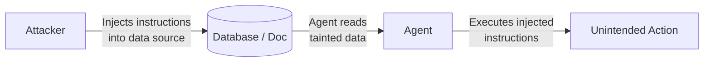

# Lab 4: Securing Data Used By The Agent

**Duration:** ~20 minutes

???+ abstract "What You'll Secure"
    Agents that access real data — databases, APIs, documents — introduce serious security risks. In this lab you'll learn how attackers exploit agents through prompt injection and data exfiltration, and implement practical defenses without crippling the agent's usefulness.

---

## Learning Objectives

- Understand the threat model for agents that handle sensitive data
- Identify prompt injection vectors in tool inputs and outputs
- Implement input sanitization and output filtering
- Apply least-privilege principles to tool access
- Test your defenses against common attack patterns

---

## Overview

When an agent reads external data and acts on it, the data itself becomes an attack surface:



This is **indirect prompt injection** — the attacker never talks to the agent directly.

---

## Threat Scenarios

| Scenario | Description |
|---|---|
| **Prompt injection via documents** | A malicious document tells the agent to exfiltrate data |
| **Tool output manipulation** | An API returns instructions disguised as data |
| **Privilege escalation** | The agent is convinced to use a more powerful tool than needed |
| **Data leakage** | Sensitive context from one user leaks into another's response |

---

## Step 1: Map Your Data Flows

Before defending, understand what data the agent touches and where it comes from.

```python
# TODO: add data flow mapping exercise
```

---

## Step 2: Sanitize Tool Inputs

```python
# TODO: add input validation and sanitization
```

---

## Step 3: Filter Tool Outputs Before Passing to the Model

```python
# TODO: add output filtering to strip injected instructions from retrieved data
```

---

## Step 4: Apply Least-Privilege to Tool Access

```python
# TODO: scope tool permissions to the minimum needed for the task
```

---

## Step 5: Test with Adversarial Inputs

```python
# TODO: add test cases that simulate prompt injection attacks
```

---

## What Did We Learn?

Data security for agents requires thinking beyond the model:

- The attack surface includes every data source the agent reads
- Sanitization at both input and output reduces injection risk
- Least-privilege limits the blast radius of a successful attack
- Adversarial testing is the only way to know if defenses work

---

???+ success "Workshop Complete"
    You've built an agent, made it observable, improved its reliability, and hardened it against data attacks. Check out the [Additional Resources](./resources.md) for further reading and frameworks to take this further.
