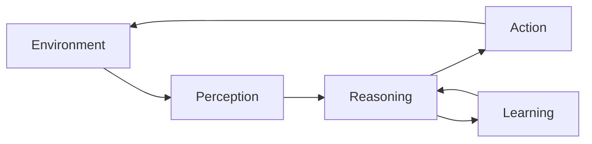

# AI Agents Workshop

???+ abstract "What You'll Learn"
    In this hands-on workshop, you'll learn how to build intelligent AI agents from the ground up. We'll cover the fundamentals of agent architecture, practical implementation patterns, and best practices for production deployment.

    **Workshop Highlights:**

    - **Foundations**: Understanding AI agents, their components, and architecture patterns
    - **Hands-On Building**: Create your first AI agent with practical examples
    - **Advanced Patterns**: Multi-agent systems, tool use, and memory management
    - **Production Ready**: Testing, monitoring, and deployment strategies
    - **Real-World Applications**: Use cases and implementation patterns

## Workshop Flow

1. [Prerequisites](./prerequisites.md) — Set up your development environment
2. [Getting Started](./getting-started.md) — Introduction to AI agents and core concepts
3. [Lab 1: Introduction to AI Agents](./lab-1.md) — Build your first simple agent
4. [Lab 2: Building Your First Agent](./lab-2.md) — Create a functional agent with tools
5. [Lab 3: Advanced Agent Patterns](./lab-3.md) — Multi-agent systems and advanced features

???+ tip "Time Estimate"
    Most participants complete the core workshop (setup + labs 1-2) in 2-3 hours. Lab 3 and advanced topics can be explored at your own pace.

---

## What Are AI Agents?

AI agents are autonomous systems that can:

- **Perceive** their environment through sensors or data inputs
- **Reason** about goals and make decisions
- **Act** to achieve objectives using available tools
- **Learn** from experience to improve performance

---

## Key Concepts

### Agent Architecture

Modern AI agents typically consist of:

- **LLM Core**: Language model for reasoning and decision-making
- **Memory**: Short-term and long-term information storage
- **Tools**: Functions the agent can call to interact with the world
- **Planning**: Strategy for breaking down complex tasks
- **Execution**: Runtime for carrying out actions

### Common Patterns

- **ReAct**: Reasoning and Acting in an interleaved manner
- **Chain-of-Thought**: Breaking down complex reasoning into steps
- **Tool Use**: Extending agent capabilities with external functions
- **Multi-Agent**: Coordinating multiple specialized agents

---

## Prerequisites

Before starting the workshop, ensure you have:

- Python 3.11 or higher
- Basic understanding of Python programming
- Familiarity with APIs and REST concepts
- (Optional) Experience with LLMs and prompt engineering

See the [Prerequisites](./prerequisites.md) page for detailed setup instructions.

---

## Workshop Structure

### Lab 1: Introduction to AI Agents
Learn the fundamentals and build a simple agent that can respond to queries.

### Lab 2: Building Your First Agent
Create a functional agent with tool use capabilities and memory.

### Lab 3: Advanced Agent Patterns
Explore multi-agent systems, advanced reasoning patterns, and production considerations.

---

## Additional Resources

- [Additional Resources](./resources.md) — Links to papers, frameworks, and tools
- [Contributing](./contributing.md) — How to contribute to this workshop

---

## Getting Help

If you encounter issues during the workshop:

1. Check the [Prerequisites](./prerequisites.md) page for setup help
2. Review the lab instructions carefully
3. Ask questions in the workshop discussion forum
4. Open an issue on GitHub for bugs or improvements

Let's get started! Head to [Prerequisites](./prerequisites.md) to set up your environment.