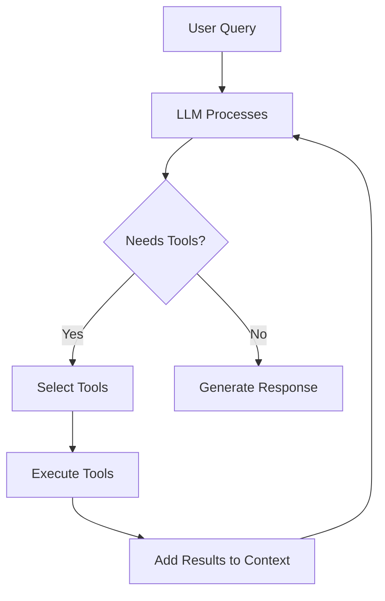

# Lab 2: Building Your First Agent with Tools

In this lab, you'll extend your agent with tool-using capabilities, allowing it to interact with external systems and perform actions beyond text generation.

## Learning Objectives

- Implement tool definitions for agents
- Enable function calling with LLMs
- Handle tool execution and results
- Build a practical agent with multiple tools

## What You'll Build

A weather and calculation agent that can:

- Get current weather information
- Perform mathematical calculations
- Search for information
- Combine multiple tools to solve complex queries

## Step 1: Install Additional Dependencies

```bash
uv pip install openai python-dotenv requests
```

## Step 2: Define Tools

Create `tools.py`:

```python
# tools.py
import requests
from typing import Dict, Any

def get_weather(location: str) -> Dict[str, Any]:
    """
    Get current weather for a location.
    
    Args:
        location: City name or coordinates
        
    Returns:
        Weather information dictionary
    """
    # Using a mock API for demonstration
    # In production, use a real weather API like OpenWeatherMap
    return {
        "location": location,
        "temperature": 72,
        "conditions": "Sunny",
        "humidity": 45,
        "wind_speed": 10
    }

def calculate(expression: str) -> float:
    """
    Safely evaluate a mathematical expression.
    
    Args:
        expression: Mathematical expression to evaluate
        
    Returns:
        Result of the calculation
    """
    try:
        # Use eval with restricted namespace for safety
        allowed_names = {
            "abs": abs, "round": round, "min": min, "max": max,
            "sum": sum, "pow": pow
        }
        result = eval(expression, {"__builtins__": {}}, allowed_names)
        return float(result)
    except Exception as e:
        return f"Error: {str(e)}"

def search_web(query: str) -> str:
    """
    Search the web for information.
    
    Args:
        query: Search query
        
    Returns:
        Search results summary
    """
    # Mock implementation
    # In production, integrate with a real search API
    return f"Search results for '{query}': [Mock results would appear here]"


# Tool definitions for OpenAI function calling
TOOL_DEFINITIONS = [
    {
        "type": "function",
        "function": {
            "name": "get_weather",
            "description": "Get the current weather for a specific location",
            "parameters": {
                "type": "object",
                "properties": {
                    "location": {
                        "type": "string",
                        "description": "The city name or location"
                    }
                },
                "required": ["location"]
            }
        }
    },
    {
        "type": "function",
        "function": {
            "name": "calculate",
            "description": "Perform mathematical calculations",
            "parameters": {
                "type": "object",
                "properties": {
                    "expression": {
                        "type": "string",
                        "description": "Mathematical expression to evaluate"
                    }
                },
                "required": ["expression"]
            }
        }
    },
    {
        "type": "function",
        "function": {
            "name": "search_web",
            "description": "Search the web for information",
            "parameters": {
                "type": "object",
                "properties": {
                    "query": {
                        "type": "string",
                        "description": "The search query"
                    }
                },
                "required": ["query"]
            }
        }
    }
]

# Map function names to actual functions
AVAILABLE_FUNCTIONS = {
    "get_weather": get_weather,
    "calculate": calculate,
    "search_web": search_web
}
```

## Step 3: Create the Tool-Using Agent

Create `agent_with_tools.py`:

```python
# agent_with_tools.py
import os
import json
from openai import OpenAI
from dotenv import load_dotenv
from tools import TOOL_DEFINITIONS, AVAILABLE_FUNCTIONS

load_dotenv()

class ToolAgent:
    """An AI agent that can use tools to accomplish tasks."""
    
    def __init__(self, model="gpt-4o-mini"):
        self.client = OpenAI(api_key=os.getenv("OPENAI_API_KEY"))
        self.model = model
        self.conversation_history = []
        
        self.system_prompt = """
        You are a helpful AI assistant with access to tools.
        When you need information or need to perform actions:
        1. Determine which tool(s) to use
        2. Call the appropriate tool(s)
        3. Use the results to formulate your response
        
        Always explain what you're doing and why.
        """
    
    def chat(self, user_message: str, max_iterations=5) -> str:
        """
        Process a user message, potentially using tools.
        
        Args:
            user_message: The user's input
            max_iterations: Maximum number of tool calls to prevent loops
            
        Returns:
            The agent's final response
        """
        # Add user message to history
        self.conversation_history.append({
            "role": "user",
            "content": user_message
        })
        
        iteration = 0
        while iteration < max_iterations:
            iteration += 1
            
            # Prepare messages
            messages = [
                {"role": "system", "content": self.system_prompt}
            ] + self.conversation_history
            
            # Call the LLM with tools
            response = self.client.chat.completions.create(
                model=self.model,
                messages=messages,
                tools=TOOL_DEFINITIONS,
                tool_choice="auto"
            )
            
            response_message = response.choices[0].message
            
            # Check if the model wants to call tools
            if response_message.tool_calls:
                # Add the assistant's response to history
                self.conversation_history.append({
                    "role": "assistant",
                    "content": response_message.content,
                    "tool_calls": [
                        {
                            "id": tc.id,
                            "type": tc.type,
                            "function": {
                                "name": tc.function.name,
                                "arguments": tc.function.arguments
                            }
                        }
                        for tc in response_message.tool_calls
                    ]
                })
                
                # Execute each tool call
                for tool_call in response_message.tool_calls:
                    function_name = tool_call.function.name
                    function_args = json.loads(tool_call.function.arguments)
                    
                    print(f"🔧 Calling tool: {function_name}")
                    print(f"   Arguments: {function_args}")
                    
                    # Execute the function
                    function_to_call = AVAILABLE_FUNCTIONS[function_name]
                    function_response = function_to_call(**function_args)
                    
                    print(f"   Result: {function_response}\n")
                    
                    # Add tool response to history
                    self.conversation_history.append({
                        "role": "tool",
                        "tool_call_id": tool_call.id,
                        "name": function_name,
                        "content": str(function_response)
                    })
                
                # Continue the loop to get the final response
                continue
            else:
                # No more tool calls, return the response
                assistant_message = response_message.content
                self.conversation_history.append({
                    "role": "assistant",
                    "content": assistant_message
                })
                return assistant_message
        
        return "Maximum iterations reached. Please try rephrasing your request."
    
    def reset(self):
        """Clear conversation history."""
        self.conversation_history = []


def main():
    """Run an interactive session with the tool-using agent."""
    print("Tool-Using AI Agent")
    print("=" * 50)
    print("Available tools: weather, calculator, web search")
    print("Type 'quit' to exit, 'reset' to clear history\n")
    
    agent = ToolAgent()
    
    while True:
        user_input = input("You: ").strip()
        
        if not user_input:
            continue
            
        if user_input.lower() == 'quit':
            print("Goodbye!")
            break
            
        if user_input.lower() == 'reset':
            agent.reset()
            print("Conversation history cleared.\n")
            continue
        
        try:
            print()  # Blank line before tool calls
            response = agent.chat(user_input)
            print(f"Agent: {response}\n")
        except Exception as e:
            print(f"Error: {e}\n")


if __name__ == "__main__":
    main()
```

## Step 4: Test Your Agent

Run the agent:

```bash
python agent_with_tools.py
```

Try these example queries:

```
You: What's the weather in San Francisco?
🔧 Calling tool: get_weather
   Arguments: {'location': 'San Francisco'}
   Result: {'location': 'San Francisco', 'temperature': 72, ...}

Agent: The current weather in San Francisco is sunny with a temperature of 72°F...

You: Calculate 15 * 23 + 100
🔧 Calling tool: calculate
   Arguments: {'expression': '15 * 23 + 100'}
   Result: 445.0

Agent: The result is 445.

You: What's the weather in Tokyo and how much is 100 + 200?
🔧 Calling tool: get_weather
   Arguments: {'location': 'Tokyo'}
   Result: {...}
🔧 Calling tool: calculate
   Arguments: {'expression': '100 + 200'}
   Result: 300.0

Agent: In Tokyo, the weather is... And 100 + 200 equals 300.
```

## Understanding Tool Calling

### Tool Definition Format

```python
{
    "type": "function",
    "function": {
        "name": "function_name",
        "description": "What the function does",
        "parameters": {
            "type": "object",
            "properties": {
                "param_name": {
                    "type": "string",
                    "description": "Parameter description"
                }
            },
            "required": ["param_name"]
        }
    }
}
```

### The Tool Calling Loop



## Exercises

### Exercise 1: Add a New Tool

Add a unit conversion tool:

```python
def convert_units(value: float, from_unit: str, to_unit: str) -> float:
    """Convert between units."""
    conversions = {
        ("celsius", "fahrenheit"): lambda x: x * 9/5 + 32,
        ("fahrenheit", "celsius"): lambda x: (x - 32) * 5/9,
        ("km", "miles"): lambda x: x * 0.621371,
        ("miles", "km"): lambda x: x / 0.621371,
    }
    
    key = (from_unit.lower(), to_unit.lower())
    if key in conversions:
        return conversions[key](value)
    return f"Conversion not supported"
```

### Exercise 2: Add Error Handling

Improve tool execution with better error handling:

```python
try:
    function_response = function_to_call(**function_args)
except Exception as e:
    function_response = {
        "error": str(e),
        "message": "Tool execution failed"
    }
```

### Exercise 3: Add Tool Usage Logging

Track which tools are being used:

```python
class ToolAgent:
    def __init__(self, model="gpt-4o-mini"):
        # ... existing code ...
        self.tool_usage_stats = {}
    
    def log_tool_use(self, tool_name: str):
        self.tool_usage_stats[tool_name] = \
            self.tool_usage_stats.get(tool_name, 0) + 1
    
    def get_stats(self):
        return self.tool_usage_stats
```

## Key Takeaways

1. **Tools extend agent capabilities** beyond text generation
2. **Function calling** is built into modern LLMs
3. **Tool definitions** must be clear and well-documented
4. **Iteration** may be needed for complex multi-tool tasks
5. **Error handling** is critical for reliable agents

## Next Steps

Proceed to [Lab 3: Advanced Agent Patterns](./lab-3.md) to learn about multi-agent systems and advanced architectures!

---

## Additional Resources

- [OpenAI Function Calling Guide](https://platform.openai.com/docs/guides/function-calling)
- [Tool Use Best Practices](https://docs.anthropic.com/claude/docs/tool-use)