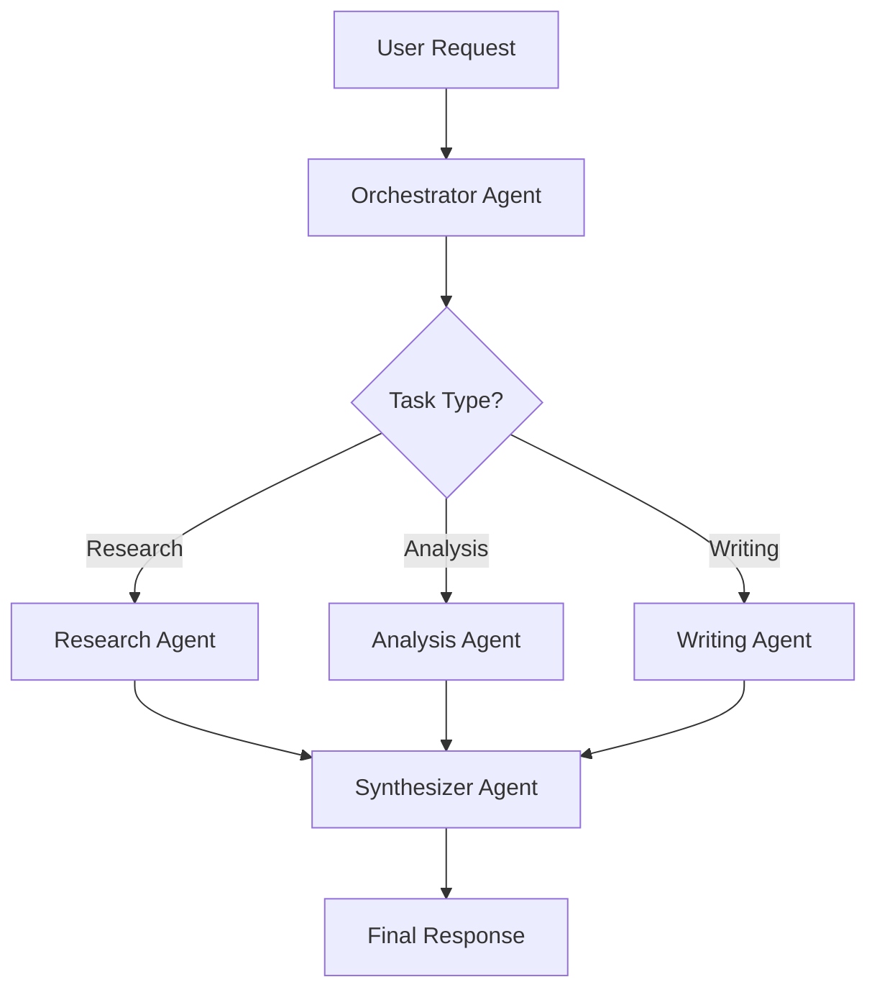

# Lab 3: Advanced Agent Patterns

In this lab, you'll explore advanced agent architectures including multi-agent systems, memory management, and production-ready patterns.

## Learning Objectives

- Implement multi-agent systems
- Add persistent memory to agents
- Build agent orchestration patterns
- Apply production best practices

## Coming Soon

This lab is currently under development. Check back soon for:

- Multi-agent collaboration patterns
- Advanced memory systems
- Agent orchestration frameworks
- Production deployment strategies
- Monitoring and observability
- Security and safety considerations

## Preview: Multi-Agent Architecture



## Topics to be Covered

### 1. Multi-Agent Systems
- Agent roles and specialization
- Communication protocols
- Task delegation
- Result aggregation

### 2. Memory Systems
- Vector databases for long-term memory
- Conversation summarization
- Knowledge graphs
- Retrieval strategies

### 3. Advanced Reasoning
- Chain-of-Thought prompting
- Tree-of-Thoughts exploration
- Self-reflection and critique
- Planning and replanning

### 4. Production Patterns
- Error handling and recovery
- Rate limiting and quotas
- Monitoring and logging
- Testing strategies

## Placeholder Code Examples

### Multi-Agent Coordinator

```python
class AgentCoordinator:
    """Coordinates multiple specialized agents."""
    
    def __init__(self):
        self.agents = {
            "research": ResearchAgent(),
            "analysis": AnalysisAgent(),
            "writing": WritingAgent()
        }
    
    async def process_task(self, task: str):
        # Determine which agents to use
        # Coordinate their work
        # Synthesize results
        pass
```

### Memory-Enhanced Agent

```python
class MemoryAgent:
    """Agent with persistent memory."""
    
    def __init__(self):
        self.vector_store = VectorStore()
        self.conversation_buffer = []
    
    def remember(self, content: str):
        # Store in vector database
        pass
    
    def recall(self, query: str):
        # Retrieve relevant memories
        pass
```

## Stay Tuned

This lab will be completed soon. In the meantime:

1. Review [Lab 1](./lab-1.md) and [Lab 2](./lab-2.md)
2. Experiment with your own agent implementations
3. Explore the [Additional Resources](./resources.md)

---

## Feedback Welcome

Have ideas for what should be included in this lab? Open an issue or discussion on GitHub!